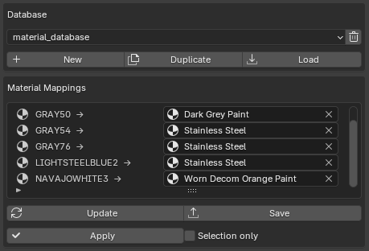

# STEPper NEXT - STEP File Importer for Blender

Blender addon for importing STEP (`.step` / `.stp`) files directly into Blender using the OpenCASCADE (OCC) geometry kernel. The produced mesh is a triangulation of the underlying CAD surface with smooth normals computed from the analytic shape geometry.

Originally created by **ambi** (Tommi Hyppanen). Now maintained by **Peak Design** (Oskaras Spalvys).

## Features

- Direct STEP file import via OpenCASCADE
- Analytic surface normals for smooth, seamless shading on curved surfaces
- Per-face vertex colors and automatic material creation from STEP color data
- Part hierarchy preserved as Blender object tree
- Robust handling of corrupted geometry - attempts to import everything it can instead of skipping entire parts
- ShapeFix healing for shapes with missing or damaged geometry
- Native C++ mesh extraction with multithreaded normal computation
- Up to 10x faster import speeds compared to v1.x
- Material database system for automatic material replacement on import

## Material Database

The material database lets you define mappings from generic STEP material names (e.g., "GRAY", "BLACK") to authored Blender materials. Once configured, materials are automatically replaced every time you import a STEP file.

### Setup

1. Import a STEP file normally. Objects load with generic STEP materials.
2. Assign the Blender materials you want to each part (e.g., replace "GRAY" with "Stainless Steel" etc.).
3. In the **STEPper NEXT: Material DB** sidebar panel, click **New** to create a database. The addon scans the scene and records what each original STEP material was replaced with.
4. Manually assign/tweak material mappings in the mapping table if required.
5. The database is saved as a `.blend` file in the addon's `MaterialDB/` folder.

### Importing with a Database

Select a database from the dropdown in the STEP import dialog under **Material DB**. The selected database persists between sessions. When importing, all matching STEP materials are automatically replaced.

### Panel Buttons

| Button | Description |
|--------|-------------|
| **New** | Create a new database from the current scene. Scans all STEP objects and records current material assignments. If the same original material was replaced with different materials on different parts, the most common replacement wins. |
| **Duplicate** | Copy the active database under a new name. Useful for minor variations between projects. |
| **Load** | Reload mappings from the active database file and append its materials into the current file. |
| **Delete** (trash icon) | Delete the active database file. |
| **Update** | Scan the scene for any new original STEP material names not already in the database and add them. **Does not modify existing mappings.** USe this to expand and grow your material database. Does not auto-save. |
| **Save** | Write the current mappings and materials to the database file. |
| **Apply** | Apply the active database mappings to objects in the scene. Works with the **Selection only** checkbox to limit to selected objects. |

### Material Mappings Table

Each row shows an original STEP material name and a dropdown to pick the replacement Blender material. You can change any mapping and click **Save** to update the database.

### Notes

- Databases are stored in the `MaterialDB/` folder inside the addon directory.
- The active database selection is stored in addon preferences and persists across sessions and files.
- Original STEP material names are stored on each imported object as a `STEP_materials` custom property, so re-applying a different database always works correctly.
- Linked materials (e.g., from the Blender asset browser) are fully supported. A local copy is saved into the database file so it can be loaded in any `.blend` file.

## Requirements

- **Windows 10+ (64-bit)** - Windows only for now
- **Blender 5.1** with Python 3.13
- Visual Studio C++ Redistributable: https://learn.microsoft.com/en-us/cpp/windows/latest-supported-vc-redist?view=msvc-170 (vc_redist.x64.exe)

## Installation

1. Download the latest release repo as a `.zip` file.
2. In Blender, go to **Edit > Preferences > Add-ons** and click **Install...**, then select the `.zip` file.
3. Enable the addon in the Add-ons list.

The importer panel will appear in **3D View > Tools panel > STEPper NEXT**.

## Uninstall / Update

Restart Blender, then remove the addon from Preferences > Add-ons. To update, remove the old version first, restart Blender, then install the new `.zip`.

## Version History

| Version | Blender | Changes |
|---------|---------|---------|
| 2.2.0   | 5.1     | Material database system for automatic material replacement, fixed apply-scale on instanced/multi-user meshes |
| 2.1.3   | 5.1     | Renamed to STEPper NEXT, auto-apply scale, skip empty objects, preferences now persist across sessions |
| 2.1.x   | 5.1     | Multithreaded normal computation, performance optimizations, crash fixes for corrupt STEP files |
| 2.1.0   | 5.1     | Updated to pythonocc-core 7.9.3 / Python 3.13, native C++ mesh extraction |
| 2.0.0   | 5.0     | Ported to Blender 5.0 API, added import diagnostics and failed parts reporting |
| 1.1.8   | 4.2.1   | Last release by ambi |

## Support

This addon is free and open source under the GPL v3 license.

**ambi** - original creator:
https://ambient.gumroad.com/l/stepper

**Peak Design** - current maintainer, tips welcome:
https://ko-fi.com/oskarasspalvys

## License

This program is free software under the [GNU General Public License v3](https://www.gnu.org/licenses/gpl-3.0.html).

Copyright 2021 Tommi Hyppanen
Modified 2026 by Peak-Design
